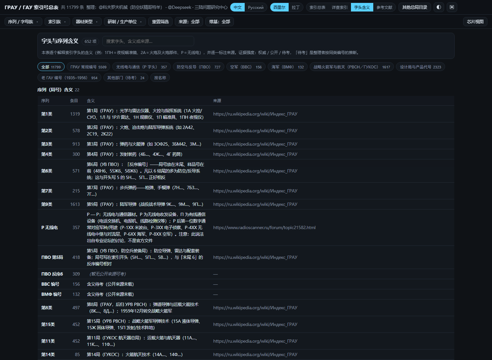

# ГРАУ / ГАУ 索引号总表

苏联／俄罗斯 **ГРАУ**（Главное ракетно-артиллерийское управление，总火箭炮兵部）与 **ГАУ**（Главное артиллерийское управление，总炮兵部）索引号的对照总表：把 `2С19`、`9К37`、`6Б47` 这类编号还原成名称、类别、研制生产单位，并附维基百科多语简介与缩略图。

**完全离线可用**：一个单文件网页 + 一个原生 Windows 程序，图片与卡片全部内嵌，不需要联网、不需要服务器。

> 🌐 **在线使用（免下载）：<https://kovorv.github.io/grau-index/>** —— 同一套界面的网页版，缩略图按需加载，手机／平板浏览器亦可打开。

> 👤 **作者主页：<https://kovorv.github.io/>** —— 我的其他小工具与联系方式都汇总在这里。

## v1.4.2.1 更新

- **字头含义**：新增「字头含义」页（652 项＝22 个序列／局号含义 + 629 个字头含义 + 通用规则），逐条解释 `1А`、`1ПН`、`2А`、`9М`、`Р`、`А3` 这类字头是什么意思，并标注来源与证据强度（**权威／公开／待考**）；原生程序与网页的字头后面**直接显示注解**，悬停可看完整释义与原文引文。
- **ПВО 反序 6 字头收敛**：按「类别字母 + 6」合并（`48Н6`／`55Ж6`／`58Ж6-01` → `Н6`／`Ж6`），该大类字头 233 → **24**。
- **老 ГАУ 编号合并**：51…58 八个局号大类合并为 **1 个大类**，字头改为局号（51…58）。
- 大类总数 28 → **22**，字头 912 → **629**（条目数不变，仍是 11 799）。
- 交付包内附 **构建源码**（见下）。

## 下载

> 📦 **[Releases 页面](https://github.com/Kovorv/grau-index/releases/latest)** —— 从那里下载，每个附件的下载次数由 GitHub 官方统计（仓库 Traffic 里的 Clones 并不等于下载量）。

| 文件 | 大小 | 说明 |
| --- | --- | --- |
| [**grau_index.html**](https://github.com/Kovorv/grau-index/releases/download/v1.4.2.1/grau_index.html) | 49.9 MB | 单文件网页，中文／俄文双语界面，双击用浏览器打开即可 |
| [**GRAU_index_v1.4.2.1.exe**](https://github.com/Kovorv/grau-index/releases/download/v1.4.2.1/GRAU_index_v1.4.2.1.exe) | 32.8 MB | 原生 Windows 程序（WinForms），免安装、不依赖浏览器、无需额外运行时 |
| [**grau_index.v1.4.2.1.zip**](https://github.com/Kovorv/grau-index/releases/download/v1.4.2.1/grau_index.v1.4.2.1.zip) | 118.7 MB | **完整交付包**：单文件网页 + 原生程序 + CSV／xlsx + 参考文献 + 免责声明 + `thumbs/` 缩略图目录 + `源码/` |
| [免责声明.txt](免责声明.txt) | 3 KB | 完整免责声明 |
| [参考文献.md](参考文献.md) | 310 KB | 1 418 条参考文献目录 |

## 界面

## 功能

- **搜索**：西里尔字母与拉丁字母互通（输入 `9k37` 等于 `9К37`），支持多词 AND、引号短语、相关度排序、输入联想与命中高亮；可切换「仅搜索引／代号」
- **筛选**：序列、索引族、器材类型、研制／生产单位、来源、卡片 六组下拉 + 左侧三级树形浏览（索引体系组 → 大类 → 字头，字头直接带注解）
- **字头含义**：629 个字头 + 22 个序列逐条释义，可搜索、可按名称／条目数排序，每条标注来源与证据强度
- **条目详情**：北约代号、系列归属、俄／中文说明、字头含义、研制与生产单位、维基多语简介与缩略图
- **装备关联**：所属装备（弹药 → 火炮／坦克／导弹系统）与构成部件，双向链接、无死链
- **其他总局目录**：ГБТУ 对象目录 590 条 · 工程器材 208 条 · ГАУ 56/57 老索引 478 条 · МО 索引 11 条
- **参考文献**：1 418 条来源可检索，双击在浏览器打开原始链接
- 中文／俄文界面切换、明暗主题、导出 CSV

## 数据规模（v1.4.2.1）

| 项目 | 数量 |
| --- | --- |
| 索引条目 | 11 799 |
| 索引体系组 / 大类 / 字头 | 9 / 22 / 629 |
| 维基卡片 | 2 227 |
| 缩略图 | 1 785 |
| 专名与代号 | 1 672 |
| 装备关联（所属装备 / 构成部件） | 4 071 条 |
| 研制／生产单位 | 116 家 |
| 参考文献 | 1 418 |

## 源码

`源码/` 目录含生成上面全部交付物的脚本与数据层：网页构建脚本（`build_all.ps1`、`build_v1.cjs`、`build_v1_tail.cjs`、`v1_client.js`、`sys_classify.cjs`、`rel_scan.cjs`、`build_xlsx.cjs`、`build_biblio.cjs`、`verify_links.cjs` 等）、原生程序源码（`源码/native/Data.cs`、`MainForm.cs`、`Program.cs`、`exp_native.cjs`）与数据层（`源码/data/master.json`、`parts/*.json`、`biblio/references.json`），附 `源码/README-源码.md` 说明构建顺序与运行环境（Node.js ≥ 18、PowerShell 5.1、.NET Framework 4 `csc`）。

## 数据来源

1. **русская-сила.рф** —— «Индексные обозначения ГРАУ»（另有 ГБТУ、ПВО 分组表）
2. **500maketov.ru** —— «Известные индексы ГРАУ»
3. **SALIS3**（ver. 329, 2011-06-11）—— PDF 目录 «Индексы Главного Ракетно-Артиллерийского Управления МО»
4. **Википедия**（俄／英／中及其他语种，CC BY-SA）与公开网页
5. 其他总局目录与补充资料：bmz.ru、guns.ru 索引汇编、俄国防部《工程器材目录》、С. Сарайкин 专文、rwd-mb3.de 等

完整清单（含每条的链接与引用次数）见 [参考文献.md](参考文献.md)。

## 免责声明

本索引是**个人整理的非官方公开资料汇编**，仅供检索、参考与研究使用，不代表任何官方名录，与俄罗斯国防部、ГРАУ／ГАУ 及任何军工企业均无隶属关系。编号、描述与译名可能存在错漏，**请以俄方原始来源与官方文件为准**。图片与文字来自公开渠道，版权归原作者（维基内容为 CC BY-SA 授权），如涉侵权或不宜公开的内容请联系删除。完整条款见 [免责声明.txt](免责声明.txt)。

## 整理

**@科夫罗夫机械（防空妖精哥特羊）**（数据合并与校订、翻译与译名、排版与配图）· **@Deepseek**（资料检索与抽取流程、脚本与构建）· **三陆问题研究中心**（选题与资料核校）

> 本仓库放最终交付物（单文件网页、原生程序、参考文献、免责声明）与构建源码（`源码/`）；完整交付包（CSV、XLSX、缩略图目录、源码副本）见 Releases。
