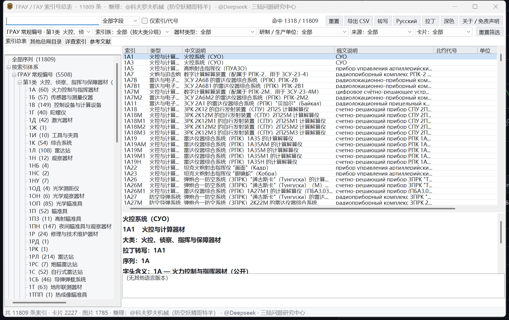

# GRAU一站式索引系统

苏联／俄罗斯 **ГРАУ**（Главное ракетно-артиллерийское управление，火箭炮兵总局）索引号的对照检索工具。

**完全离线可用**：一个单文件网页 + 一个原生 Windows 程序，图片与卡片全部内嵌，不需要联网、不需要服务器。

> 🌐 **在线使用（免下载）：<https://kovorv.github.io/grau-index/>** —— 同一套界面的网页版，缩略图按需加载，手机／平板浏览器亦可打开。

## v1.4.2.2 更新（内容与 v1.4.2.1 一致）

- **版本号推进到 v1.4.2.2**：v1.4.2.1 的修正当日是**在原 release 内就地替换附件**发布的（release 条目与 tag 都没变），下载页上看不出更新；本版推进版本号、重新构建全部产物并单独发布，**数据内容与 v1.4.2.1 完全相同**（没有条目增删）。
- **字头含义**：新增「字头含义」页（652 项＝22 个序列／局号含义 + 628 个字头含义 + 通用规则），逐条解释 `1А`、`1ПН`、`2А`、`9М`、`Р`、`А3` 这类字头是什么意思，并标注来源与证据强度（**权威／公开／待考**）；原生程序与网页的字头后面**直接显示注解**，悬停可看完整释义与原文引文。
- **ПВО 反序 6 字头收敛**：按「类别字母 + 6」合并（`48Н6`／`55Ж6`／`58Ж6-01` → `Н6`／`Ж6`），该大类字头 233 → **24**。
- **老 ГАУ 编号合并**：51…58 八个局号大类合并为 **1 个大类**，字头改为局号（51…58）。
- 大类总数 28 → **22**，字头 912 → **628**（本版条目 11 809）。
- **数据订正**：补入 **11 条 14Ф（ГУКОС）索引**（`14Ф11` 纳里亚德反导、`14Ф17` 格洛纳斯、`14Ф132` 箭-3М、`14Ф133` 康多尔、`14Ф136` 鱼叉、`14Ф137` 角色、`14Ф138` 莲花-С、`14Ф139` 牡丹-НКС、`14Ф148` 雪豹-М、`14Ф149` 报喜、`14Ф160` 格洛纳斯-К1），14Ф 一类由 10 → **21 条**；删除误收的假条目 `1РЛС232` 及其派生假字头 `1РЛС`；专名 1 686 条全部带中文，参考文献 1 428 条。
- 交付包内附 **构建源码**（见下）。

## 下载

> 📦 **[Releases 页面](https://github.com/Kovorv/grau-index/releases/latest)

| 文件 | 大小 | 说明 |
| --- | --- | --- |
| [**grau_index.html**](https://github.com/Kovorv/grau-index/releases/download/v1.4.2.2/grau_index.html) | 50.0 MB | 单文件网页，中文／俄文双语界面，双击用浏览器打开即可 |
| [**GRAU_index_v1.4.2.2.exe**](https://github.com/Kovorv/grau-index/releases/download/v1.4.2.2/GRAU_index_v1.4.2.2.exe) | 32.8 MB | 原生 Windows 程序（WinForms），免安装、不依赖浏览器、无需额外运行时 |(推荐）

## 界面

## 功能

- **搜索**：西里尔字母与拉丁字母互通，支持多词、引号短语、相关度排序、输入联想与命中高亮；可切换「仅搜索引／代号」
- **筛选**：序列、索引族、器材类型、研制／生产单位、来源、有无维基
- **字头含义**：628 个字头 + 22 个序列逐条释义，可搜索、可按名称／条目数排序
- **条目详情**：系列归属、俄／中文说明、字头含义、研制与生产单位、维基多语简介与缩略图（注意北约代号基本缺失）
- **装备关联**：所属装备（弹药 → 火炮／坦克／导弹系统）与构成部件双向链接
注意局限性：GRAU索引并不包含：大多数航空兵器，战车机电设备，发动机等子系统

## 数据来源

1. **русская-сила.рф** —— «Индексные обозначения ГРАУ»（另有 ГБТУ、ПВО 分组表）
2. **500maketov.ru** —— «Известные индексы ГРАУ»
3. **SALIS3**（ver. 329, 2011-06-11）—— PDF 目录 «Индексы Главного Ракетно-Артиллерийского Управления МО»
4. **Википедия**（俄／英／中及其他语种，CC BY-SA）与公开网页
5. 其他总局目录与补充资料：bmz.ru、guns.ru 索引汇编、俄国防部《工程器材目录》、С. Сарайкин 专文、rwd-mb3.de 等

完整清单（含每条的链接与引用次数）见 [参考文献.md](参考文献.md)。

## 免责声明

本索引是**个人整理的非官方公开资料汇编**，仅供检索、参考与研究使用，不代表任何官方名录，与俄罗斯国防部、ГРАУ及任何军工企业均无隶属关系。编号、描述与译名可能存在错漏，**请以俄方原始来源与官方文件为准**。图片与文字来自公开渠道，版权归原作者（维基内容为 CC BY-SA 授权），如涉侵权或不宜公开的内容请联系删除。完整条款见 [免责声明.txt](免责声明.txt)。

## 整理

**@科夫罗夫机械（防空妖精哥特羊）**· **@Deepseek**· **三陆问题研究中心**
