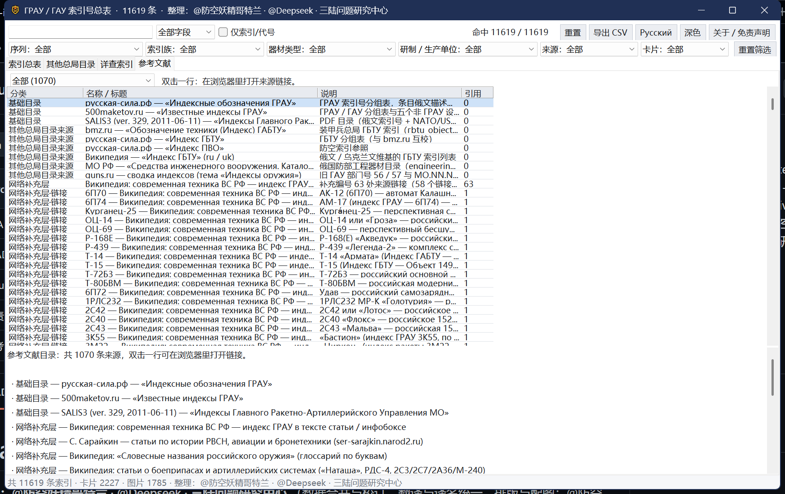

# ГРАУ / ГАУ 索引号总表

苏联／俄罗斯 **ГРАУ**（Главное ракетно-артиллерийское управление，总火箭炮兵部）与 **ГАУ**（Главное артиллерийское управление，总炮兵部）索引号的对照总表：把 `2С19`、`9К37`、`6Б47` 这类编号还原成名称、类别、研制生产单位，并附维基百科多语简介与缩略图。

**完全离线可用**：一个单文件网页 + 一个原生 Windows 程序，图片与卡片全部内嵌，不需要联网、不需要服务器。

> 🌐 **在线使用（免下载）：<https://kovorv.github.io/grau-index/>** —— 同一套界面的网页版，缩略图按需加载，手机／平板浏览器亦可打开。

## 下载

| 文件 | 大小 | 说明 |
| --- | --- | --- |
| [**grau_index.html**](https://github.com/Kovorv/grau-index/raw/main/grau_index.html) | 66.4 MB | 单文件网页，中文／俄文双语界面，双击用浏览器打开即可 |
| [**GRAU_index_v1.4.2.exe**](https://github.com/Kovorv/grau-index/raw/main/GRAU_index_v1.4.2.exe) | 45.8 MB | 原生 Windows 程序（WinForms），免安装、不依赖浏览器、无需额外运行时 |
| [免责声明.txt](免责声明.txt) | 3 KB | 完整免责声明 |
| [参考文献.md](参考文献.md) | 214 KB | 1 070 条参考文献目录 |

## 界面

## 功能

- **搜索**：西里尔字母与拉丁字母互通（输入 `9k37` 等于 `9К37`），支持多词 AND、引号短语、相关度排序、输入联想与命中高亮；可切换「仅搜索引／代号」
- **筛选**：序列、索引族、器材类型、研制／生产单位、来源、卡片 六组下拉 + 左侧树形浏览
- **条目详情**：北约代号、系列归属、俄／中文说明、研制与生产单位、维基多语简介与缩略图
- **其他总局目录**：ГБТУ 对象目录 590 条 · 工程器材 208 条 · ГАУ 56/57 老索引 478 条 · МО 索引 11 条
- **参考文献**：1 070 条来源可检索，双击在浏览器打开原始链接
- 中文／俄文界面切换、明暗主题、导出 CSV

## 数据规模（v1.4.2）

| 项目 | 数量 |
| --- | --- |
| 索引条目 | 11 619 |
| 维基卡片 | 2 227 |
| 缩略图 | 1 785 |
| 专名与代号 | 1 651 |
| 研制／生产单位 | 116 家 |
| 参考文献 | 1 070 |

## 数据来源

1. **русская-сила.рф** —— «Индексные обозначения ГРАУ»（另有 ГБТУ、ПВО 分组表）
2. **500maketov.ru** —— «Известные индексы ГРАУ»
3. **SALIS3**（ver. 329, 2011-06-11）—— PDF 目录 «Индексы Главного Ракетно-Артиллерийского Управления МО»
4. **Википедия**（俄／英／中及其他语种，CC BY-SA）与公开网页
5. 其他总局目录与补充资料：bmz.ru、guns.ru 索引汇编、俄国防部《工程器材目录》、С. Сарайкин 专文、rwd-mb3.de 等

完整清单（含每条的链接与引用次数）见 [参考文献.md](参考文献.md)。

## 免责声明

本索引是**个人整理的非官方公开资料汇编**，仅供检索、参考与研究使用，不代表任何官方名录，与俄罗斯国防部、ГРАУ／ГАУ 及任何军工企业均无隶属关系。编号、描述与译名可能存在错漏，**请以俄方原始来源与官方文件为准**。图片与文字来自公开渠道，版权归原作者（维基内容为 CC BY-SA 授权），如涉侵权或不宜公开的内容请联系删除。完整条款见 [免责声明.txt](免责声明.txt)。

## 整理

**@防空妖精哥特兰**（数据合并与校订、翻译与译名、排版与配图）· **@Deepseek**（资料检索与抽取流程、脚本与构建）· **三陆问题研究中心**（选题与资料核校）

> 本仓库只放最终交付物。完整交付包（CSV、XLSX、缩略图目录、详细构建说明）不在此仓库内。
